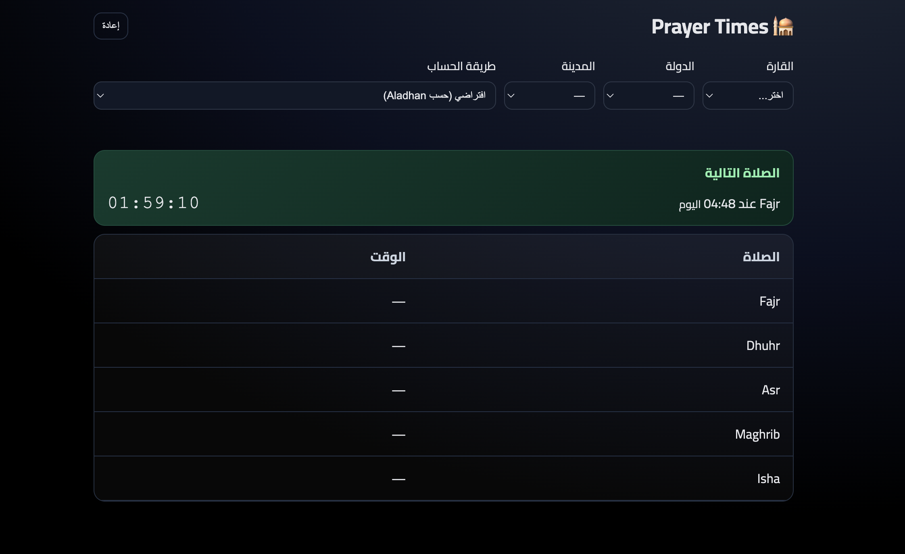

# 🕌 Prayer Times Web App 

## 📸 Here's a preview of the expected UI:

## 🎯 Objective
Build a single-page Prayer Times Web App that fetches Islamic prayer times using the Aladhan API. The app should let users select a continent, then a country, then a city, and display the 5 daily prayers in a clean table. It must include a live countdown timer for the next prayer (HH:MM:SS), support multiple calculation methods, and handle errors gracefully. Use modern JavaScript (ES6 modules) and clean architecture.

## 👤 User Stories
As a user:
- I want to select a continent, then a country, then a city to view prayer times.
- I want to choose a calculation method so prayer times match my preference.
- I want to see only the 5 main prayers (Fajr, Dhuhr, Asr, Maghrib, Isha) in a table.
- I want to see a live countdown showing time remaining until the next prayer (HH:MM:SS).
- I want to see which prayer is next and at what time (today/tomorrow).
- I want a friendly error message if something goes wrong (network, invalid city, etc.).
- I want the UI to be responsive and accessible on mobile and desktop.

## 🔑 Acceptance Criteria
- Continent → Country → City cascading selects work dynamically.
- Countries are loaded by chosen continent (not hard-coded).
- Cities load dynamically by selected country (from API with caching).
- Calculation method dropdown works and affects results.
- Table lists exactly 5 prayers: Fajr, Dhuhr, Asr, Maghrib, Isha.
- Live countdown timer shows HH:MM:SS for the next prayer and updates every second.
- Shows “today/tomorrow” for the next prayer time.
- Clean error handling (network/API errors, empty selections, etc.).
- Modern, responsive UI with clear typography and icons.
- Uses ES6 modules with import/export and clean separation of concerns.

## ✅ Deliverables
- A fully functional Prayer Times Web App in the browser.
- ES6 modules: config, utils, api, ui, app (already scaffolded in this repo).
- DOM manipulation for rendering tables, selects, and the timer.
- API integration with Aladhan (prayer times) and country/city sources.

## 🧩 Required Features
- Continent selector (‘africa’, ‘americas’, ‘asia’, ‘europe’, ‘oceania’).
- Country dropdown populated by selected continent (via REST Countries API).
- City dropdown populated by selected country (using CountriesNow API) with caching.
- Calculation methods dropdown (Aladhan methods).
- Prayer table: Fajr, Dhuhr, Asr, Maghrib, Isha only.
- Next prayer banner with:
  - Prayer name
  - HH:MM:SS countdown
  - Exact prayer time with “today/tomorrow” label
- Error/empty states and loading indicators.
- Persist last selection (continent/country/city/method) in localStorage and auto-restore on reload.
- Reset button clears UI selections, results, timer, and localStorage.

## 🌐 APIs & Data Sources
- Prayer times: Aladhan API – `https://api.aladhan.com/v1` (no auth)
- Countries: REST Countries – `https://restcountries.com/v3.1/region/{continent}`
- Cities: CountriesNow – `https://countriesnow.space/api/v0.1/countries/cities`

## 💡 Notes & Guidance
- Keep functions small and pure in `utils.js` where possible.
- Use caching for city lists by country to reduce API calls.
- Avoid global variables except for well-contained state in modules.
- Use semantic HTML and accessible labels for inputs.
- Show loading text within selects while waiting for API data.
- Use icons (e.g., Font Awesome) for clear prayer affordances.

## 📦 What to Submit
- GitHub repository with source code, and this `README.md`
## 🧭 Suggested Milestones
1) Scaffold UI + ES6 modules and base HTML/CSS
2) Implement continent → country loading
3) Implement city loading (CountriesNow + caching)
4) Integrate Aladhan prayer times by city + calculation methods
5) Render 5-prayer table cleanly
6) Implement next prayer finder + HH:MM:SS countdown
7) Implement persistence (localStorage) and auto-restore on reload
8) Add Reset button to clear UI and localStorage
9) Error handling, accessibility, and responsive polish
10) Final refactor, documentation, and optional extras

## 💯 Evaluation Criteria
| Criteria | Weight |
|---|---|
| Correct API integration (countries/cities/prayer times) | 40% |
| DOM rendering & responsive UI quality | 20% |
| Next-prayer timer (HH:MM:SS) correctness & UX | 15% |
| Architecture & code quality (ES6 modules, utils/api/ui/app) | 15% |
| Error handling, loading, caching & persistence/reset | 10% |

## 📤 How to Submit
1. Create a GitHub repository with the project files.
2. Include `README.md`
3. Push your code and share the repository link.
---

Good luck! Focus on clean, readable code and a smooth user experience. 🚀

